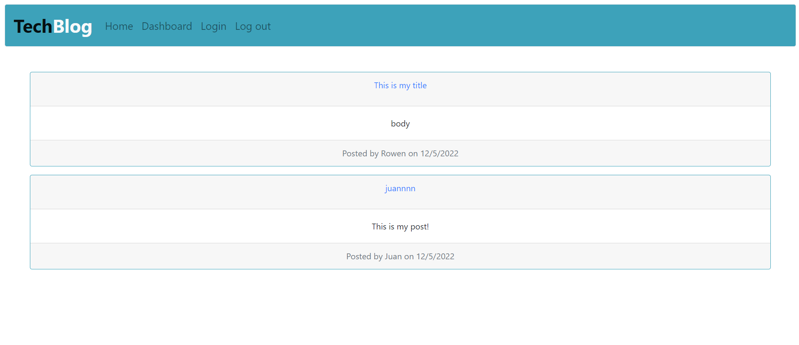

# TechBlog

## Description

This full stack application could be the front page of the internet! Create a secure profile and post anything tech you can think of! You can create posts with titles and descriptions, comment on posts, see other's posts, and collaborate to your hearts desire.

## Table of Contents

- [Installation](#installation)
- [Usage](#usage)
- [Contributing](#contributing)
- [Tests](#tests)
- [Questions](#questions)

## Installation

Install required packages with: npm i

## Usage

Use this application as directed in the website.

To run the server from your machine, first log into mysql and execute: source ./db/schema.sql;

Then, run npm start and the server will be up!

[Deployed Application](https://tech-blog-utbc.herokuapp.com/)

## Contributing

Changes to this code are not covered under any license.

## Tests

There is no built-in testing for this application.

## Questions

GitHub Username: rjschroeder

GitHub Profile: [Click Here](https://github.com/rjschroeder)

Feel free to email me with any questions you may have at my email below:

Email: are.jay.schroeder@gmail.com

